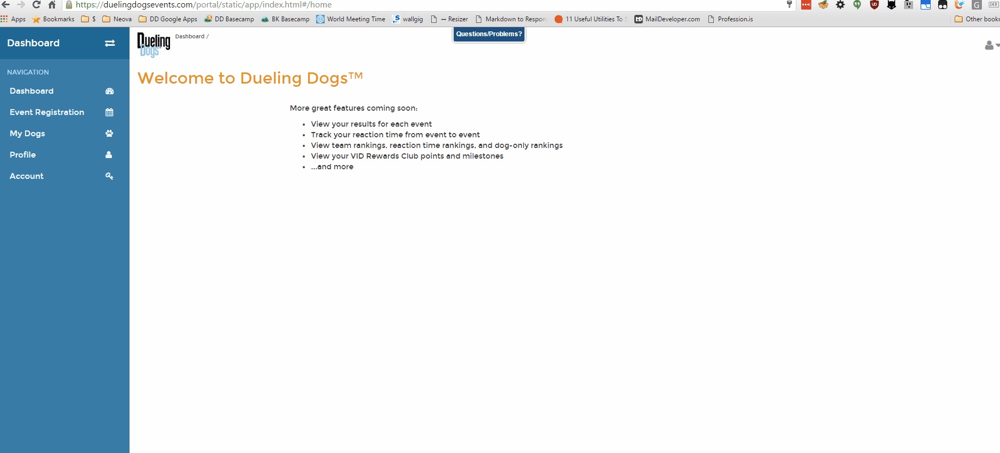

Dueling Dogs Membership
========================

Dueling Dogs Memberships can be purchased online via your Dueling Dogs Handler
account.

Dueling Dogs Membership Cost & Time Period
----------------------------------------------

* Dueling Dogs Memberships are **$35/handler/year**.

* Membership runs from 1 January through 31 December.

.. tip:: Handlers who reside in Canada will be charged in Canadian dollars and will be subject to HST.

Joining Dueling Dogs - Get A Membership
------------------------------------------

* `Sign-in <http://help.duelingdogs.net/en/latest/logging-in.html>`_ to your Dueling Dogs Handler account at `https://www.duelingdogsevents.com <https://www.duelingdogsevents.com>`_.

* Select **PROFILE** from the left hand navigation menu.

* Click the **MEMBERSHIPS** button directly below the list of handler(s).

* Select the Handler(s) you wish to purchase a membership for by clicking in the
* checkbox of the corresponding row(s) and click **NEXT**

* Enter Credit Card Payment details.

* Select **MAKE PAYMENT**

Renew Dueling Dogs Membership (2017)
---------------------------------------

.. tip:: Memberships must be renewed prior to **15 January, 2017** in order to keep your VID Points along with any rewards you may have earned such as complimentary Dueling Dogs Duels, etc. 

* 2017 Dueling Dogs Memberships are still $35/year.

* Memberships for Handlers residing in the United States are charged in USD.

* Memberships for Handlers residing in Canada are charged in CAD + HST.

* If you are a 2016 Dueling Dogs Member that has accumulated VID Points or earned VID Points Rewards such as complimentary Dueling Dogs Duels, you must renew your membership prior to **15 January, 2017** in order to avoid forfeitting the points and/or rewards.

.. tip:: If you have earned a complimentary membership through the VID Points Program you will still need to login at the `_Dueling Dogs Registration <https://www.duelingdogsevents.com>`_ page prior to **15 January, 2017** to **ACTIVATE** your membership.
